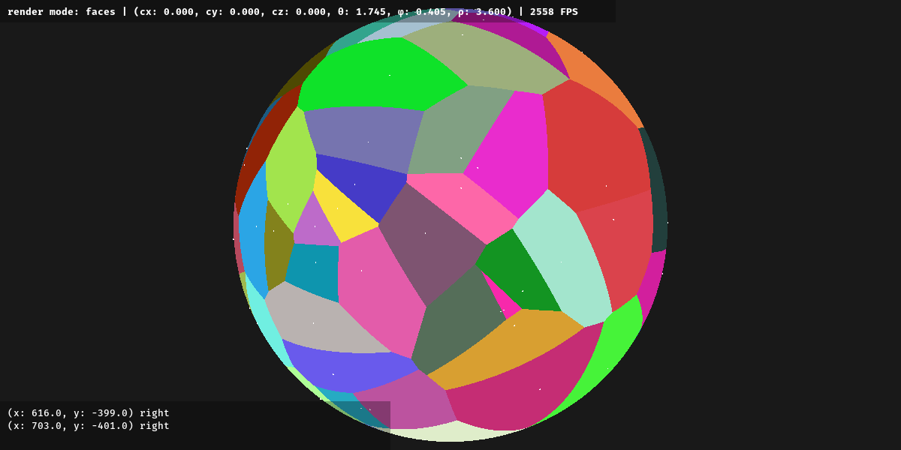
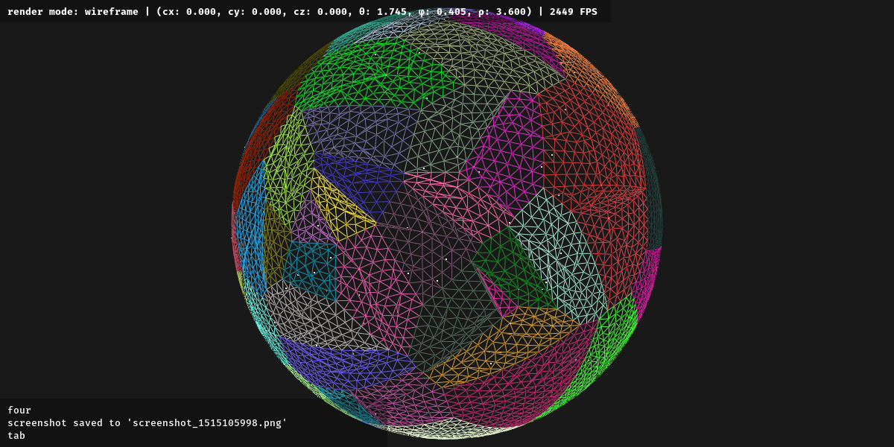
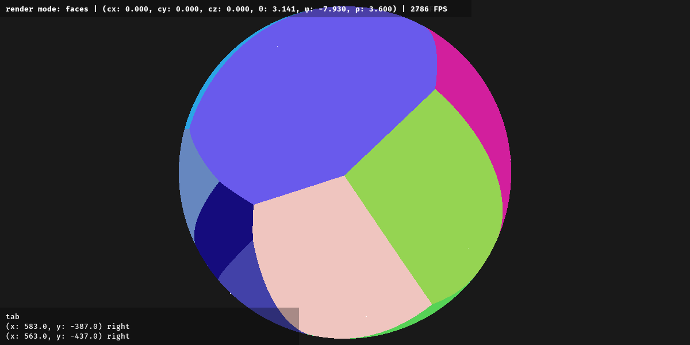
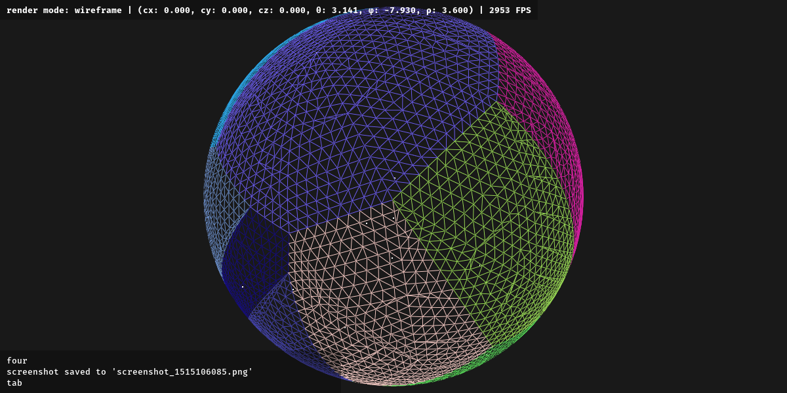
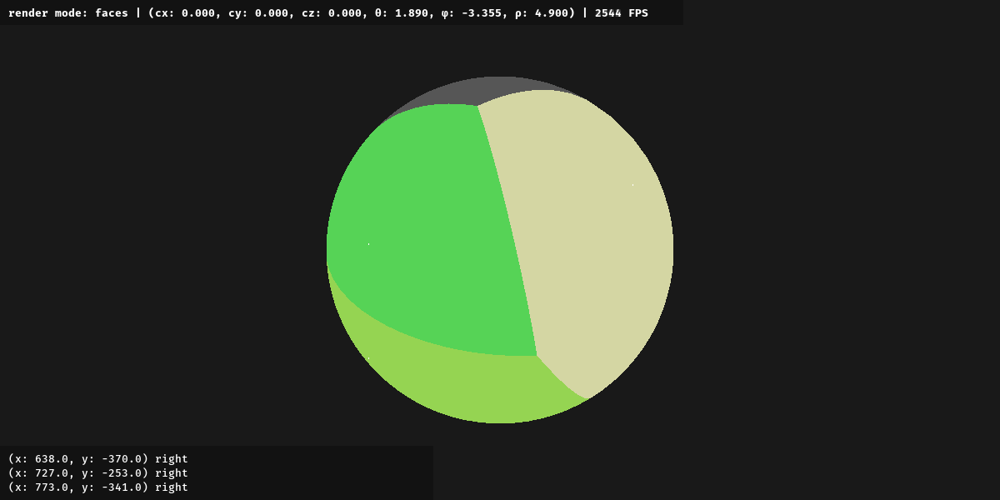
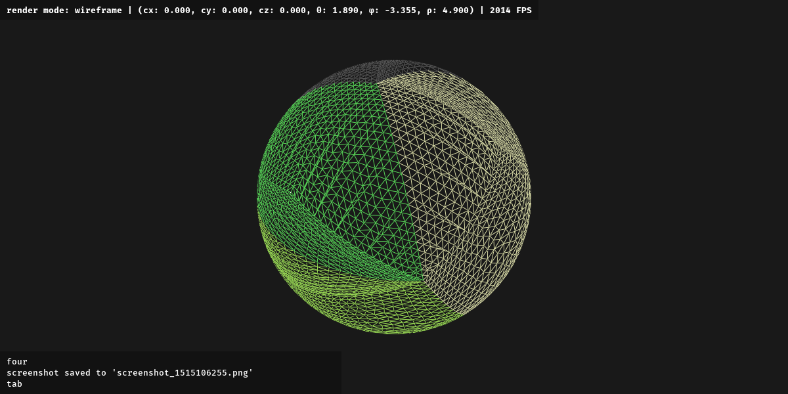
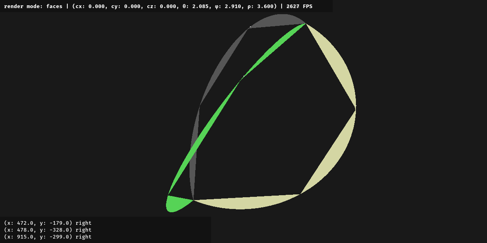

# spherical voronoi

Fortune’s algorithm on a sphere.

n = 100 sites

n = 20 sites

n = 4 sites

n = 3 sites

Note that n = 4 is the minimum number of sites required to avoid producing spherical digons which cannot be represented using mesh subdivision techniques. (At n = 2, the voronoi diagram consists of two unigonal hemispheres, and at n = 1 it is a single 0-gon encompassing the entire globe.)

The following screenshots are from before spherical mesh subdivision was implemented:

n = 600 sites

n = 6000 sites

